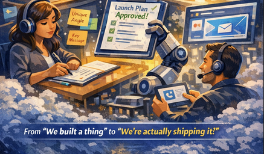

**Turn a rough build into a real launch system.**

Multi-agent flow: research competitors → nail your positioning → generate plans & assets → run supervised outbound with approvals and memory. One place to go from *“we built a thing”* to *“we’re actually shipping it.”*


---

## Why it exists

Most teams have a build. Few have a **launch system**: repeatable research, clear positioning, and execution that doesn’t rely on one person’s brain. LaunchPilot wires AI agents (Backboard) into a single flow with human checkpoints—so you approve what goes out, and the system remembers context across projects.

---

## What’s inside

| Step | What happens |
|------|----------------|
| **Research** | Agent researches competitors and landscape for your project. |
| **Positioning** | Picks a wedge and narrative; you refine. |
| **Execution** | Generates launch plan, tasks, and assets (copy, posts, etc.). |
| **Approvals** | You approve before anything is sent. |
| **Outbound** | Supervised send with step-up auth (e.g. connectors). |
| **Memory** | Shared context so agents stay on-brand and on-strategy. |

Leaderboard tracks verified tasks (e.g. text posts, video, coding, infra). Admin and security settings live in the app.



---

## Stack

- **Web:** Next.js, Tailwind, shadcn/ui  
- **API:** FastAPI, Pydantic, SQLAlchemy  
- **Agents & memory:** [Backboard](https://backboard.io)  
- **Auth:** NextAuth (Google/GitHub) or dev-mode  
- **Data:** SQLite (local) or PostgreSQL; Litestream for backup  
- **Deploy:** Docker, Terraform, AWS App Runner  

---

## Quick start

**Prereqs:** Docker, `.env` (see below).

```bash
cp .env.example .env
# Set BACKBOARD_API_KEY (required). For local dev, AUTH_MODE=dev is enough.
./start.sh
```

App: **http://localhost:8000** (API at `/v1`, web at `/`).

- **Clean reinstall (e.g. fresh `node_modules`):** `CLEAN=1 ./start.sh`
- **Build/push for deploy:** `./build.sh [env] [tag]` (see `build.sh` and `terraform/`).

---

## Environment

Copy `.env.example` to `.env`. Minimum for local:

- `BACKBOARD_API_KEY` — required for agents  
- `AUTH_MODE=dev` — no OAuth; use “Open App” / “Start in Dev Mode”  
- `WEB_APP_URL` / `NEXT_PUBLIC_API_BASE_URL` — point at your API (e.g. `http://localhost:8000` / `http://localhost:8000/v1`)  

With OAuth (Google/GitHub), set Auth0/NextAuth vars and `AUTH_MODE=oauth` (see `.env.example`). Optional: `RESEND_API_KEY` for real email, `SUPABASE_DB_URL` for Postgres instead of SQLite.

---

## Repo layout

```
apps/
  api/          # FastAPI app (routers: projects, research, positioning, execution, approvals, chat, connectors, leaderboard, admin)
  web/          # Next.js app (app router, /app/* for logged-in UI)
infra/docker/   # Docker Compose (API + web in one container, LocalStack for Litestream)
terraform/      # AWS (ECR, App Runner, SSM), bootstrap state bucket
scripts/        # Smoke tests, seed scripts
```

---

## One-liner for the internet

> **LaunchPilot:** Research → positioning → execution with approvals and memory. Multi-agent launch system so “we built a thing” becomes “we’re shipping it.”

Use that on a landing page, in a tweet, or in a doc—it’s the shareable pitch.

---

*Built with [Backboard](https://backboard.io).*
